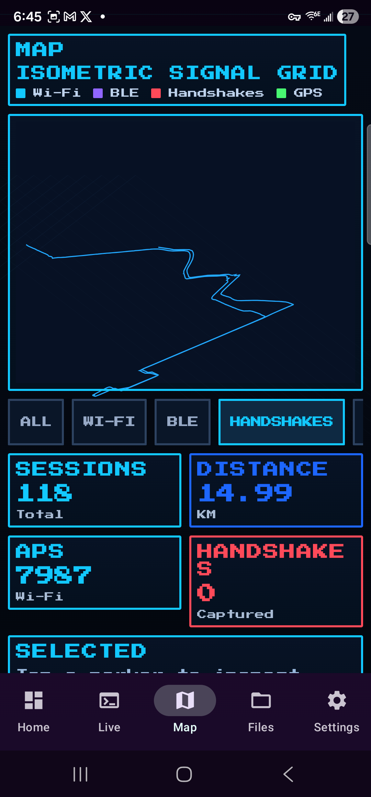
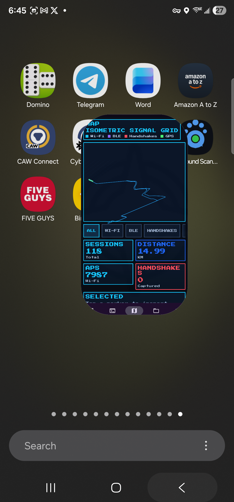
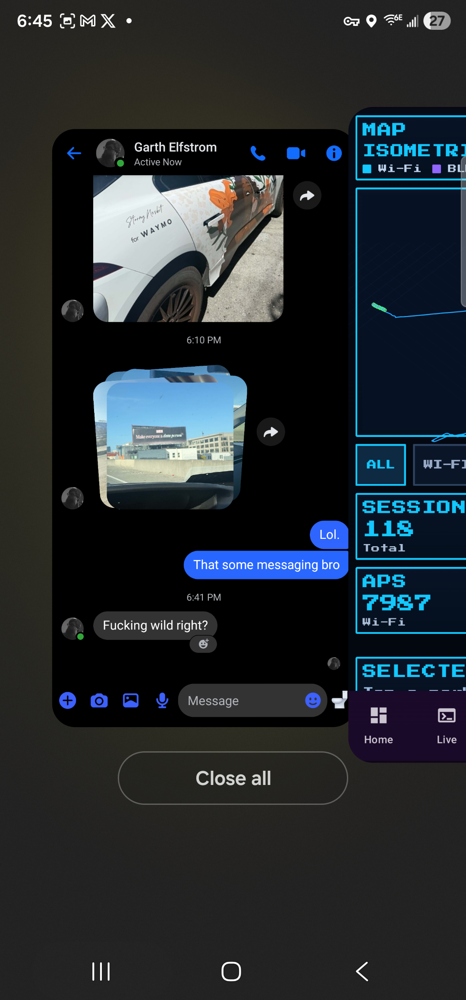
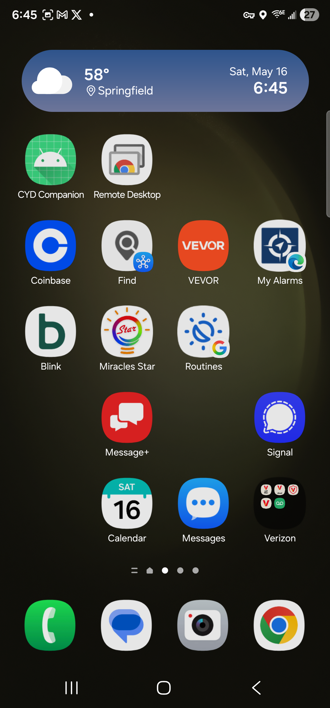
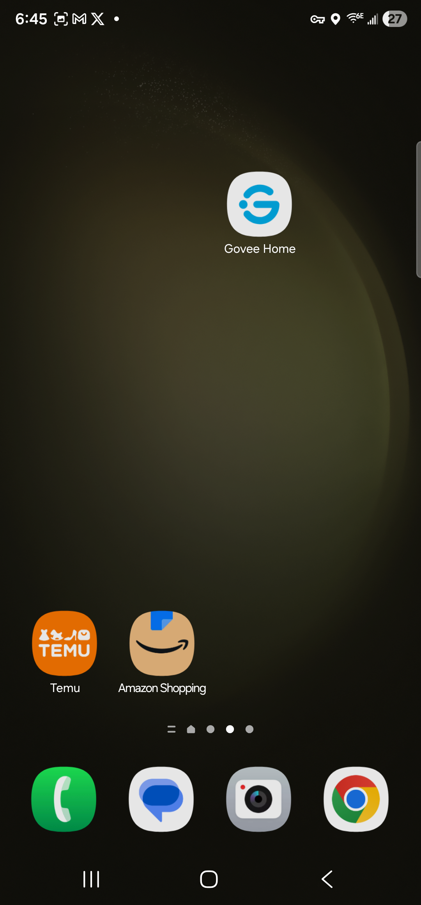

# Wardrive Analyzer Android

Android-native Wardrive Analyzer with a pixel HUD interface, map-first workflow, and Dropbox project sync.

## Vibe Check

This build is intentionally styled as a retro operations console:
- high-contrast pixel panels
- dense telemetry cards
- neon cyber HUD accents
- isometric map interaction

Target aesthetic: classic LucasArts-era UI energy with modern touch ergonomics.

## Current Status (v0.1.x)

Implemented:
- Kotlin + Jetpack Compose app shell
- Navigation: `Home`, `Live`, `Map`, `Files`, `Settings`
- Pixel-art UI overhaul on Home + map surfaces
- Custom map aggregation layer with pan/zoom/filter/select
- Map memory stabilization for large evidence sets
- Dropbox project discovery/sync + project selection
- CSV/log/PCAP ingest with Room persistence
- `wardrive_master.csv` header-aware parsing for improved PC parity

In progress:
- Exact metric parity validation against PC `summary.html` / `pcap_summary.html`
- Additional icon/sprite kit polish
- Cross-screen typography calibration

## Screenshot Gallery

> Captured from live Android build on device.

### Home


### Live


### Map


### Files


### Settings


## Install APK

Prebuilt APKs are published in GitHub Releases.

- `wardrive-analyzer-release.apk`
- `wardrive-analyzer-debug.apk`

On Android:
1. Download APK from Releases.
2. Allow install from unknown sources.
3. Open APK and install.

## Build Locally

```powershell
.\gradlew.bat assembleDebug
.\gradlew.bat assembleRelease
```

Artifacts:
- `app/build/outputs/apk/debug/app-debug.apk`
- `app/build/outputs/apk/release/app-release.apk`

## Dropbox Sync Notes

- Home now shows project sync status only.
- Dropbox token/root/zip configuration lives in `Settings`.
- Zip filename can be left blank to allow archive fallback resolution.

## Parity Map (Desktop -> Android)

- `core/parser_logs.py` -> `ingest/WardriveLogParser.kt`
- `core/parser_pcap.py` -> `ingest/PcapIngestService.kt`
- `core/project.py` manifests -> Room entities/DAOs
- `summary.html` / `pcap_summary.html` metrics -> Android reports/map stats (ongoing parity pass)
